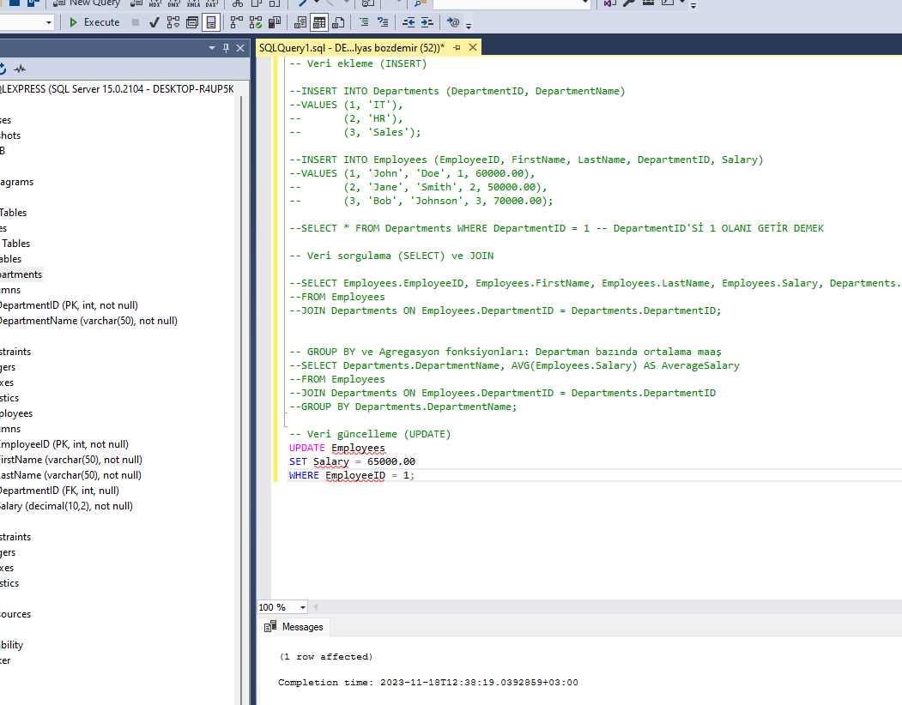

## Adım 1: database olusturma 

veritabanı bu şekilde de olusturulur


veritabanı adı girme


olusan veritabanı görsel :


## Adım 2: tablo  olusturma 


### New Query ile (diğer yöntem) 


butona basılıp bos bir sayfa acılır

bu komutla db olusur


use ile hangi veritabanında işlem yapılcaksa onu kullan denilir use kullan demek


tablo olsuturmak için bunu yazıp F% tusuna basılır veya gorselde ki gibi execute butonuna basılır. yani kodu derle demek.


solda iki görselin olusturuldugu görüntülencektir.
 ama yukarda ki yenile tusuna basılması lazım öncegörsel aşagıdadır.


sekilde ki gibi o butona basılır


veya asagıda kikomut yazılır  where kısmından sonra ki sart koşar
şart kosulmazsa hepsini hedef alır


SElect tablodan sütun seçmek içindir 
* hepsini seç demek ama sütun adları da verilebilir.

AŞAGIDA Kİ KOMUT `Departments` TABLOSUNDAN  `DepartmentID` sütununu seç demek

```sql 
 
 SELECT DepartmentID FROM Departments

```

tablodan veri silmek için,
burda dikkat edilmesi gerekn husus where ile kosul vermek
ve de veri türlerine dikkat etmek


tablodan veri güncellemek için,
burda dikkat edilmesi gerekn husus where ile kosul vermek
ve de veri türlerine dikkat etmek veri türlerine göz atmak için
[tıklayınız](veri-turleri.md)   





